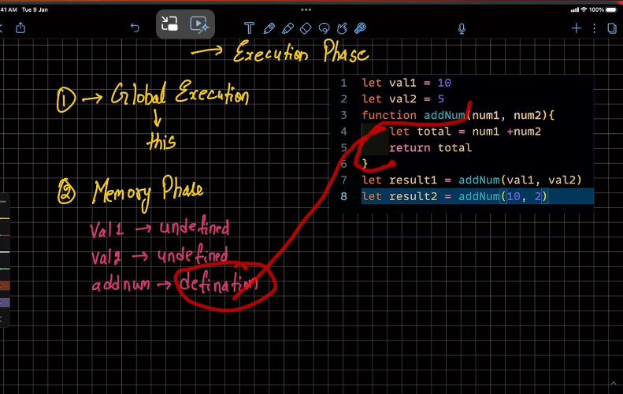

```Three Phases
Global Enviroment setup
Memory Creation phase
Execution phase
```


```Firstly Global execution will be performed and the context will be set in this variable```

Then Memory Phase will start
and all the variables will be allocated undefined





Whenever JS compiler encounter function new enviroment will be formed in which again Memory Allocation and Execution phase will occur.


The return from each function will return back to Global Execution


The new executional context created for each function gets deleted after the work is done


```Call Stack```


